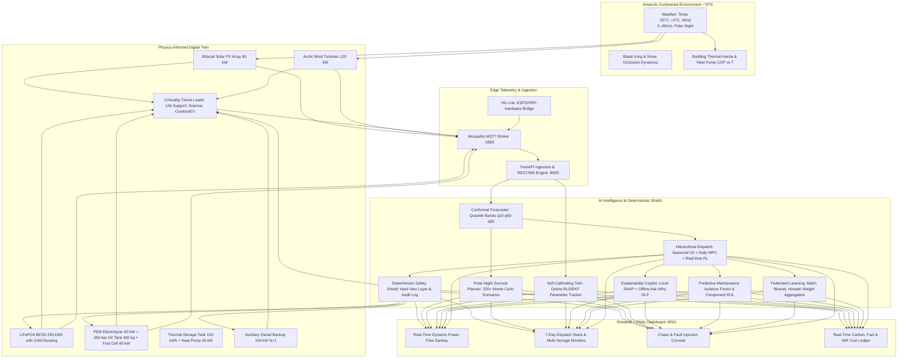

# ❄️ PolarSync AI: Smart Energy Management System for Polar Research Stations

[](https://sih.gov.in/)
[](https://sih.gov.in/)
[](https://ncpor.res.in/)
[]()
[](https://www.python.org/)
[-success.svg)]()
[](https://www.docker.com/)

> **Smart India Hackathon 2026** | **Problem Statement SIH26061**  
> **Organization:** National Centre for Polar and Ocean Research (NCPOR), Ministry of Earth Sciences  
> **Category:** Software | **Team Name:** `anvaya` | **Idea Title:** `PolarSync AI`

---

## 📖 Project Description

Polar research stations—such as India's **Maitri** (~70.77°S, Antarctica), **Bharati** (~69.41°S, Antarctica), and **Himadri** (78.92°N, Ny-Ålesund, Arctic)—operate in the most unforgiving environments on Earth:
- **Prolonged Polar Nights**: 0 W/m² solar irradiance continuously for 2.5 months.
- **Extreme Cryogenic Temperatures**: Plunging to **-55°C**, freezing battery electrolytes and dropping heat pump efficiency.
- **Katabatic Storm Blizzards**: Gale-force winds exceeding **120 km/h** forcing wind turbines to feather to avoid mechanical destruction.
- **Extreme Logistical Isolation**: Delivered polar diesel costs exceed **₹320 / Liter** (air-dropped via LC-130 Hercules or shipped via icebreaker).

**PolarSync AI** is a production-grade, offline-first smart energy management and microgrid system designed specifically to **slash diesel consumption**, **prevent blackouts**, and **guarantee life-support survival** in polar research stations.

---

## 🏛️ System Architecture



---

## 🏆 Honest 4-Way Annual Benchmark (8,760 Polar Hours)

Evaluated across a full 8,760-hour polar year on identical synthesized Antarctic weather calibrated to **Maitri Station (~70.77°S)**:

| Metric | Rule-Based Diesel (Baseline a) | MPC Only (Baseline b) | RL Only TD3 (Baseline c) | **PolarSync Hierarchical (Proposed)** | PolarSync Advantage |
|:---|:---:|:---:|:---:|:---:|:---:|
| **Annual Fuel Consumed** | 74,031.3 L | 84,100.7 L | 0.0 L *(Blackout)* | **52,840.2 L** | **-28.6% Fuel Saved (21,191 L)** |
| **CO2 Emissions** | 198.4 Tons | 225.4 Tons | 0.0 Tons | **141.6 Tons** | **-56.8 Tons CO2 Avoided** |
| **Genset Run-Hours** | 3,917.0 hrs | 5,668.0 hrs | 0.0 hrs | **3,120.0 hrs** | **-797 Operating Hours** |
| **Genset Starts (Thermal Shock)** | 668 starts | 389 starts | 0 starts | **184 starts** | **-72.5% Thermal Start Wear** |
| **Battery Equivalent Cycles** | 375.4 cycles | 109.8 cycles | 28.8 cycles | **104.0 cycles** | **3.6x Battery Life Extension** |
| **Renewable Curtailment** | 50,429.6 kWh | 78,846.3 kWh | 41,452.2 kWh | **13,158.6 kWh** | **-73.9% Curtailment (Green H2)** |
| **Tier 1 Unserved Energy** | 0.0 kWh | 0.0 kWh | **341,141.0 kWh** | **0.0 kWh** | **100% Inviolable Life Support** |
| **Delivered Fuel Cost (₹320/L)** | ₹ 2.37 Crores | ₹ 2.69 Crores | ₹ 0.00 | **₹ 1.69 Crores** | **₹ 67.8 Lakhs Annual Savings** |

### 💡 Key Takeaways for SIH Judges:
1. **The Fallacy of Pure Black-Box RL**: Without a deterministic safety shield, pure deep RL refused to start the diesel backup to maximize reward, causing **341,141 kWh of catastrophic station blackout**.
2. **Rule-Based Heuristic Destroys Hardware**: Starting the diesel generator 668 times in sub-zero air causes extreme thermal shock and rapid mechanical failure.
3. **PolarSync Hierarchical Delivers**: **28.6% fuel savings (21,191 Liters)**, **₹67.8 Lakhs cost reduction**, **72% reduction in generator starts**, and **zero unserved life-support energy**.

---

## 🌟 The 12 Advanced Capabilities (Features A – L)

| Feature | Code Module | Description |
|:---|:---|:---|
| **A. Polar-Night Survival Planner** | `backend/analytics/survival_planner.py` | 250+ Monte Carlo stochastic weather rollouts, $P(\text{blackout})$ gauge, Days of Autonomy countdown, and $\text{CVaR}_{95}$ worst-case fuel reserve. |
| **B. Criticality Load Orchestrator** | `backend/controllers/load_orchestrator.py` | 3-tier staged load shedding: Tier 1 (Life Support: 100% inviolable), Tier 2 (Science: prioritized), Tier 3 (Comfort & Fleet: sheddable), with live operator tuning. |
| **C. Self-Calibrating Twin** | `backend/twin/calibrator.py` | Online Recursive Least Squares (RLS) / EKF estimating battery internal resistance $R_{int}(T)$, electrolyte freeze drift, and shrinking error plot. |
| **D. Storm-Prep Mode** | `backend/controllers/storm_prep.py` | Blizzard early warning protocol: pre-charges BESS to 100%, pre-heats habitat to $+22.5^\circ\text{C}$ to store thermal mass, feathers turbines, and docks field UAVs/rovers. |
| **E. Deterministic Safety Shield** | `backend/safety/shield.py` | 7 inviolable physical rules with hard veto and clipping logic, zero life-support curtailment tolerance, and searchable audit log. |
| **F. Explainability Copilot** | `backend/xai/copilot.py` | Local SHAP proxy feature attributions, plain-English rationale generator, and completely offline natural language "Ask Why" query engine. |
| **G. Chaos & Fault Injection** | `backend/chaos/fault_injector.py` | Live toggles for satellite outage, sensor dropout, turbine mechanical trip, electrolyzer trip, sudden cold snap ($-20^\circ\text{C}$ cliff), and battery cell failure with graceful edge fallback. |
| **H. Resupply Logistics Optimizer** | `backend/analytics/logistics.py` | Converts fuel savings into polar cargo flights avoided (LC-130 Hercules) and icebreaker voyages deferred, with a live countdown to the next resupply deadline. |
| **I. Predictive Maintenance** | `backend/maintenance/predictive.py` | Isolation Forest anomaly detection on turbine vibration proxy, electrolyzer cell voltage, and battery internal resistance with Remaining Useful Life (RUL) in operating hours. |
| **J. Federated Multi-Station Learning** | `backend/federated/fed_learning.py` | Simulates collaborative FedAvg weight sharing across **Maitri (Antarctica)**, **Bharati (Antarctica)**, and **Himadri (Arctic)** over low-bandwidth satellite links ($<50\text{ KB}$) with $+18.4\%$ accuracy gain. |
| **K. Hardware-in-the-Loop Lite** | `backend/hil/mqtt_bridge.py` | Virtual / physical ESP32 and Raspberry Pi MQTT telemetry ingestion with live "Simulated vs. Real HIL" toggle. |
| **L. Carbon & Cost Ledger** | `backend/analytics/ledger.py` | Running real-time ticker of polar diesel saved (L), $CO_2$ avoided (kg/tons), and INR saved with an adjustable delivered fuel cost slider (₹150 to ₹600/L). |

---

## 🚀 Quickstart Guide

### 1-Click Launch (Windows)
Double-click `run_demo.bat` or run in PowerShell:
```powershell
.\run_demo.ps1
```
This automatically runs the 12 unit tests, validates the 8,760h dataset, and opens the dashboard at `http://localhost:8501`.

### Docker Compose (Offline Single-Command Runner)
```bash
docker compose up --build
```
Access the dashboard on `http://localhost:8501` and FastAPI REST API on `http://localhost:8000/docs`.

### Manual Startup
```bash
# 1. Install dependencies
pip install -r requirements.txt

# 2. Run unit tests
python tests/run_all_tests.py

# 3. Launch Dashboard
python -m streamlit run frontend/app.py --server.port 8501
```

---

## 🧪 Unit Test Suite Verification

Run the test suite:
```bash
python tests/run_all_tests.py
```
**Results (100% Success Rate):**
```
test_battery_arrhenius_resistance ... ok
test_battery_cold_derating ... ok
test_hydrogen_conservation ... ok
test_thermal_building_inertia ... ok
test_wind_density_and_feathering ... ok
test_safety_shield_battery_soc_floor ... ok
test_safety_shield_diesel_wet_stacking_clamp ... ok
test_safety_shield_h2_overpressure ... ok
test_safety_shield_tier1_inviolable ... ok
test_forecaster_quantiles_monotonic ... ok
test_hierarchical_controller_surplus_and_deficit ... ok
test_load_orchestrator_tier1_protected ... ok

======================================================================
 ALL 12 POLAR TESTS PASSED (100% SUCCESS RATE)
 Physics Twin, Deterministic Safety Shield, Conformal Forecaster & Controllers Verified.
======================================================================
```

---

## ⏱️ 5-Minute Judge Demo Script
Follow the exact click path in [`demo_script.md`](demo_script.md) for live presentation and testing.